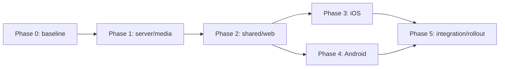

# Native Playback Ownership Master Implementation Plan

> **For agentic workers:** REQUIRED SUB-SKILL: Use superpowers:subagent-driven-development (recommended) or superpowers:executing-plans to implement this plan task-by-task. Steps use checkbox (`- [ ]`) syntax for tracking.

**Goal:** Ship one backward-compatible HYMNZ mobile release whose iOS and Android binaries own playback natively, continue through lock/background transitions, keep system metadata and React state synchronized, and can be enabled gradually without disrupting the existing 160-user audience.

**Architecture:** The React application talks to one versioned `PlaybackEngine` contract and selects a native Capacitor adapter only when the installed binary, protocol version, app version, and deterministic server flag are compatible. The server resolves access just in time and returns short-lived full or preview streams; AVPlayer on iOS and Media3 ExoPlayer in an Android `MediaSessionService` own queues, interruptions, system controls, persistence, and authoritative state. The current `HTMLAudioElement` path remains a tested web/old-binary fallback for one complete native release cycle.

**Tech Stack:** Next.js 16 App Router, React 19, TypeScript 5, Zustand 5, Vitest 3, Drizzle/PostgreSQL, AWS S3/CloudFront, Sharp, Capacitor 8, Swift 5/XCTest/AVFoundation/MediaPlayer, Java/JUnit/Jetpack Media3 1.11.0, Xcode, Gradle.

**Spec:** `docs/superpowers/specs/2026-08-21-native-playback-ownership-design.md`

## Global Constraints

- Mobile native playback is selected only when `HymnzPlayback.getCapabilities()` reports protocol version `1` or newer and the server flag enables that installation.
- Existing store binaries without the plugin must continue through `WebPlaybackAdapter`; never deploy live web code that assumes the plugin exists.
- React sends commands and renders returned/event snapshots; it never claims playback succeeded optimistically.
- A snapshot is accepted only when it starts a new `sessionId` or has a `sequence` greater than the last accepted sequence for the current session.
- Queue loading passes identifiers and metadata, not playable URLs, and never consumes the one-free-listen grant.
- Only just-in-time resolution can consume a free listen; repeated range requests and seeks within that resolved item cannot consume another grant.
- Playback bearer tokens are opaque, stored hashed on the server, scoped only to playback endpoints, expire after 24 hours, and never enter Zustand, browser storage, logs, or telemetry.
- Visitors receive preview resolutions without a playback bearer token and are rate limited.
- iOS deployment remains `16.0`; Android remains `minSdk 24`, `compileSdk 36`, and `targetSdk 36`.
- iOS uses the `.playback` audio-session category and adds `audio` to `UIBackgroundModes` while preserving `remote-notification`.
- Android owns playback in a `MediaSessionService` foreground service and declares both media-playback foreground-service permissions.
- Cold launch restores queue and position as paused; no process relaunch may start audio automatically.
- Headphone/Bluetooth disconnection pauses; interruption resumption occurs only when the system recommends it and playback was active beforehand.
- New artwork derivatives are square RGB JPEG at exactly 512×512 and 1024×1024; fallback order is track, collection, bundled HYMNZ brand artwork.
- Native playback remains disabled in production until both store binaries pass physical-device gates; rollout proceeds 5%, 25%, 50%, 100% with a verified kill switch.
- Do not implement offline downloads, crossfade, cross-device control, CarPlay/Android Auto browsing, casting orchestration, lossless selection, or a native UI rewrite.
- Preserve unrelated worktree changes and do not reformat adjacent code.

## Effort and release shape

| Phase | Deliverable | Engineering effort | Production exposure |
|---|---|---:|---|
| 0 | Baseline, durable status ledger, and release guardrails | 2–3 days | None |
| 1 | Server playback sessions/resolver, access extraction, artwork pipeline, settings, telemetry | 7–10 days | Web-compatible endpoints only; native disabled |
| 2 | Shared protocol/controller, hardened web adapter, store/UI reconciliation | 7–10 days | Existing web engine remains selected |
| 3 | iOS AVPlayer engine, background mode, Now Playing, remote controls | 8–13 days | Internal/TestFlight only |
| 4 | Android Media3 service, media session, notification, audio focus | 8–13 days | Internal Play track only |
| 5 | Cross-platform verification, store release, staged activation | 4–10 days | 5% → 25% → 50% → 100% |
| **Total** | **Native ownership at 100% with fallback retained** | **36–59 engineering days** | **One store release, activated gradually** |

For one engineer, plan on approximately 8–12 calendar weeks including device soak time and store review. Two engineers can overlap iOS and Android after Phase 2, bringing active development closer to 5–7 weeks, but the rollout observation windows do not compress safely.

## Plan set and dependencies

1. `docs/superpowers/plans/2026-08-21-native-playback-01-server-media-foundation.md`
   - Task IDs `NP-SRV-01` through `NP-SRV-07`.
   - Can begin immediately.
   - Produces the API and metadata contract consumed by every engine.
2. `docs/superpowers/plans/2026-08-21-native-playback-02-shared-web-controller.md`
   - Task IDs `NP-WEB-01` through `NP-WEB-07`.
   - Begins after `NP-SRV-03` fixes the resolver response contract.
   - Must complete before either native bridge is activated.
3. `docs/superpowers/plans/2026-08-21-native-playback-03-ios-engine.md`
   - Task IDs `NP-IOS-01` through `NP-IOS-07`.
   - Begins after `NP-WEB-01` freezes protocol version 1 and `NP-SRV-03` is deployed to a test environment.
4. `docs/superpowers/plans/2026-08-21-native-playback-04-android-engine.md`
   - Task IDs `NP-AND-01` through `NP-AND-07`.
   - Begins after the same protocol/server gates as iOS; may run concurrently with Phase 3 only when two implementers are available.
5. `docs/superpowers/plans/2026-08-21-native-playback-05-integration-rollout.md`
   - Task IDs `NP-REL-01` through `NP-REL-07`.
   - Begins after both native builds pass their platform unit/build gates.
6. `docs/superpowers/plans/2026-08-21-native-playback-status.md`
   - The only current-state ledger. Update it at the end of every work session and in every task commit.



## Daily restart protocol

Every new session starts with these commands from the repository root:

```bash
git status --short --branch
git log --oneline -8
sed -n '1,220p' docs/superpowers/plans/2026-08-21-native-playback-status.md
rg -n '^- \[ \]' docs/superpowers/plans/2026-08-21-native-playback-0*.md | head -20
```

Then:

1. Read the approved design and this roadmap.
2. Open the plan named by `Next task` in the status ledger.
3. Confirm every prerequisite task listed for that task is checked.
4. Run the ledger’s `Last verification command` once before changing code; record any baseline failure instead of attributing it to the new work.
5. Execute only the first unchecked step in the active task, following red-green-refactor.
6. Do not start the next task until the active task’s focused tests, typecheck/lint/build gate, diff review, checkbox updates, and commit are complete.

The repository currently has two different `0012_*.sql` files while `drizzle/meta/_journal.json` ends at index 11. During `NP-BASE-01`, compare those files and the production `drizzle.__drizzle_migrations` table before any new migration is generated or applied. Record which 0012 changes exist in production and update the server plan’s next migration filename/meta references if Drizzle does not safely emit `0013_playback_sessions.sql`. This audit is a hard stop: never overwrite a historical migration or run an additive playback migration against an unknown journal state.

Every session ends by updating `docs/superpowers/plans/2026-08-21-native-playback-status.md` with:

- current phase and task ID;
- last completed checkbox and commit SHA;
- exact verification command and observed result;
- changed files not yet committed;
- active blocker or risk;
- the exact next unchecked step.

If a task spans days, commit only when its independently testable deliverable is complete. Leave partial work uncommitted, record every changed path in the ledger, and begin the next session by reviewing `git diff`.

## Phase 0: Baseline and release guardrails

### Task NP-BASE-01: Capture the reproducible baseline

**Files:**
- Modify: `docs/superpowers/plans/2026-08-21-native-playback-status.md`
- Create: `docs/release/native-playback/baseline.md`

**Interfaces:**
- Consumes: Current `main`, package scripts, Xcode workspace, and Android Gradle wrapper.
- Produces: A dated baseline recording exact web, iOS, and Android commands and any pre-existing failures.

- [ ] **Step 1: Create an isolated implementation worktree**

Use `superpowers:using-git-worktrees` and create branch `codex/native-playback`. Do not implement on `main` and do not discard the existing untracked `.agents/` or `AGENTS.md` files.

```bash
git branch --show-current
git worktree list
git status --short --branch
```

Expected after the skill completes: the active implementation directory is an isolated worktree on `codex/native-playback`, and its initial status contains no copied user-owned untracked files.

- [ ] **Step 2: Run the web baseline**

```bash
npm test
npx tsc --noEmit
npx eslint src/lib/hooks/useAudioPlayer.ts src/lib/hooks/useMediaSession.ts src/lib/store/playerStore.ts
npm run build
```

Expected: record the exact pass/fail count and any pre-existing failure in `docs/release/native-playback/baseline.md`.

- [ ] **Step 3: Run the native build baseline**

```bash
npm run cap:sync
xcodebuild -workspace ios/App/App.xcworkspace -scheme App -sdk iphonesimulator -configuration Debug CODE_SIGNING_ALLOWED=NO build
./android/gradlew -p android testDebugUnitTest assembleDebug
```

Expected: both builds exit 0, or their pre-existing failures are copied verbatim into the baseline document before playback changes begin.

- [ ] **Step 4: Record installed toolchain versions**

```bash
node --version
npm --version
npx cap --version
xcodebuild -version
./android/gradlew -p android --version
```

Add the output, current commit SHA, iOS deployment target `16.0`, Android SDK values `24/36/36`, and current app versions `1.0.3 (13)` iOS and `1.0.3 (6)` Android to the baseline.

- [ ] **Step 5: Audit the existing Drizzle migration journal before assigning the playback migration**

```bash
sed -n '1,260p' drizzle/meta/_journal.json
ls -1 drizzle/*.sql | sort
```

Using the non-production database first, query:

```sql
select id, hash, created_at
from drizzle.__drizzle_migrations
order by created_at;

select
  to_regclass('public.password_reset_tokens') as password_reset_tokens,
  to_regclass('public.onboarding_responses') as onboarding_responses;
```

Record whether both on-disk 0012 migrations were applied, whether their hashes appear in Drizzle history, and the safe next generated index in `docs/release/native-playback/baseline.md`. If repository journal, non-production, and production do not agree, stop before `NP-SRV-02` and reconcile migration history in a dedicated reviewed commit; never edit an already-applied SQL file. The expected safe first playback filename after reconciliation is `drizzle/0013_playback_sessions.sql`; update the three playback migration references in the reconciliation commit if the safe generated indexes differ.

- [ ] **Step 6: Mark the task complete and commit**

Update the status ledger to `Next task: NP-SRV-01`, then run:

```bash
git add docs/release/native-playback/baseline.md docs/superpowers/plans/2026-08-21-native-playback-status.md docs/superpowers/plans/2026-08-21-native-playback-roadmap.md
git commit -m "docs(playback): capture native playback baseline"
```

## Specification coverage map

| Approved design requirement | Implementing tasks |
|---|---|
| Versioned command/snapshot protocol, session/sequence ordering | `NP-SRV-01`, `NP-WEB-01`, `NP-REL-01` |
| Web/native selection, old-binary compatibility, single-engine handoff | `NP-WEB-02`, `NP-WEB-04`, `NP-WEB-05`, `NP-WEB-07` |
| Queue/repeat/shuffle/previous/failure policy | `NP-WEB-01`, `NP-WEB-03`, `NP-IOS-02`, `NP-IOS-04`, `NP-AND-02`, `NP-AND-04` |
| Scoped 24-hour token, current-tier lookup, sign-out revocation | `NP-SRV-02`, `NP-SRV-04`, `NP-WEB-05`, `NP-IOS-03`, `NP-AND-03` |
| Just-in-time full/preview resolution, ranges, expiry/retry | `NP-SRV-03`, `NP-SRV-04`, `NP-IOS-03`, `NP-IOS-04`, `NP-AND-03`, `NP-AND-04` |
| Preserve free-listen and legacy web behavior | `NP-SRV-01`, `NP-SRV-04`, `NP-REL-02`, `NP-REL-03` |
| iOS background audio, Now Playing, remote commands, routes/interruption | `NP-IOS-04`, `NP-IOS-05`, `NP-IOS-06`, `NP-IOS-07` |
| Android foreground service, MediaSession, notification, focus/noisy | `NP-AND-04`, `NP-AND-05`, `NP-AND-06`, `NP-AND-07` |
| React authoritative read-model and foreground reconciliation | `NP-WEB-04`, `NP-WEB-05`, `NP-WEB-06` |
| Artwork normalization, backfill, fallback, cache, UI reset | `NP-SRV-05`, `NP-WEB-06`, `NP-IOS-05`, `NP-AND-05` |
| Paused cold restore and duplicate-player prevention | `NP-WEB-04`, `NP-IOS-02`, `NP-IOS-04`, `NP-IOS-06`, `NP-AND-02`, `NP-AND-04` |
| Typed UX, retry/next actions | `NP-WEB-03`, `NP-WEB-06` |
| Native/web telemetry, play-count continuity, redaction, dashboard | `NP-SRV-07`, `NP-WEB-06`, `NP-IOS-04`, `NP-AND-04`, `NP-REL-02`, `NP-REL-04` |
| Stable feature flag, kill switch, staged production activation | `NP-SRV-06`, `NP-WEB-05`, `NP-REL-04`, `NP-REL-06` |
| Automated tests, device matrix, 20-track and 60-minute gates | Every subsystem’s final gate plus `NP-REL-01` through `NP-REL-05` |
| Daily resumability and operational handoff | `NP-BASE-01` and `2026-08-21-native-playback-status.md` |
| Explicitly excluded product scope | Master Global Constraints; no task adds an excluded capability |

## Release gates by phase

### Gate A — server safe to deploy

- All playback-session, resolve, preview-ticket, shared access, artwork, rollout-assignment, and telemetry tests pass.
- Database migrations are applied in a non-production environment and rolled back from a backup rehearsal.
- The legacy `/api/tracks/{id}/audio` behavior is unchanged for visitor, free, Sacred 7, one-free-listen, paid, and admin paths.
- Native playback settings return disabled for production.

### Gate B — shared controller safe to deploy

- The website and old native binaries select `WebPlaybackAdapter`.
- No React component directly creates or controls a second main-player audio element.
- Rejected web `play()` calls, stalls, errors, and `ended` events reconcile to snapshots.
- Native plugin absence, malformed capability response, and disabled flag all fall back without user-visible interruption.

### Gate C — native binaries safe for internal testing

- iOS and Android unit tests, simulator/emulator builds, protocol fixtures, and token redaction checks pass.
- Each native engine restores paused, owns queue advancement without JavaScript, publishes system metadata, and survives WebView detach/reattach.
- Production flag remains disabled.

### Gate D — safe for store submission

- Physical iPhone and Android devices each complete 20 locked-screen tracks and a 60-minute background session.
- Calls, Siri/Assistant, alarms, audio focus, wired/Bluetooth disconnect, Wi-Fi/cellular transition, offline recovery, URL expiry, repeat, shuffle, previous, seek, and queue exhaustion match the spec.
- Mixed legacy PNG/JPEG/missing artwork always reaches a valid fallback.
- Kill switch and old-binary fallback are proven in release candidates.

### Gate E — safe for 100% activation

- 5%, 25%, and 50% cohorts each remain at least 48 hours without a material regression in unexpected stops, playback failures, crash-free listening sessions, access-policy mismatches, background continuation, or artwork fallbacks.
- Support reports and telemetry identify no release-blocking issue.
- Rollback changes only the runtime flag; no emergency store submission is required.

## Definition of complete

- [ ] All task checkboxes in the five subsystem plans are checked and committed.
- [ ] Compatible iOS and Android releases select protocol version 1 at 100% rollout.
- [ ] Old binaries and browsers continue through the web adapter.
- [ ] Twenty-track locked-screen and 60-minute background gates pass on both platforms.
- [ ] System controls, interruptions, routes, artwork, access policy, and restored state match the approved design.
- [ ] Kill-switch drill prevents new native sessions and preserves an already-playing track until pause/end.
- [ ] The web fallback remains in production for at least one complete native release cycle.
